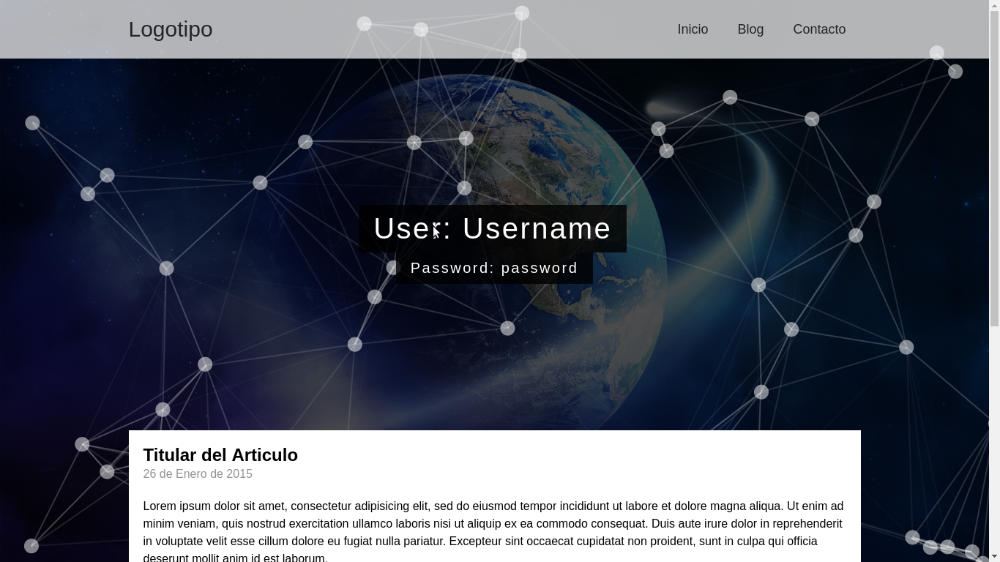

## Previsualizacion
[Click Aquí](https://blog-particles-webdesign.herokuapp.com/)

## Instalación
1. copia/descarga el proyecto
2. luego dentro del proyecto ejecuta `npm install`

## Para ejecutar el proyecto
3. ejecuta `npm start`

## luego entra en el Proyecto
4. http://localhost:3000
